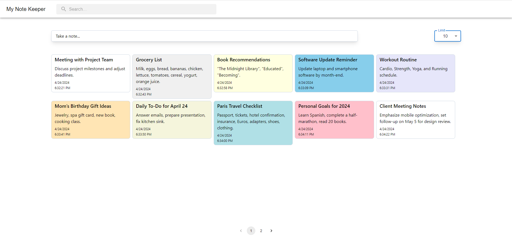

    
    

## Note Keeping App

Web-based note-taking application that leverages the Note-Keeping API for efficient management of personal and professional notes

## Libraries Used

In this project, I've used the following libraries:

- **mui/material**: Material UI components for rich UI design. [mui/material](https://mui.com/)
- **mui/icons-material**: Comprehensive icons for Material UI. [mui/icons-material](https://mui.com/components/material-icons/)
- **axios**: Promise-based HTTP client for browser and Node.js. [axios](https://github.com/axios/axios)
- **react-toastify**: Easy toast notifications for React applications. [react-toastify](https://fkhadra.github.io/react-toastify/)
- **tailwindcss**: A utility-first CSS framework for creating custom designs. [tailwindcss](https://tailwindcss.com/)
- **@headlessui/react**: Completely unstyled, fully accessible UI components for React. [headlessui/react](https://headlessui.dev/react/)

Please refer to the documentation of each library for more information on how to use them.

## Live Preview

<h4 align="left">Live Preview is available at https://note-keeping-app.onrender.com/</h4>

